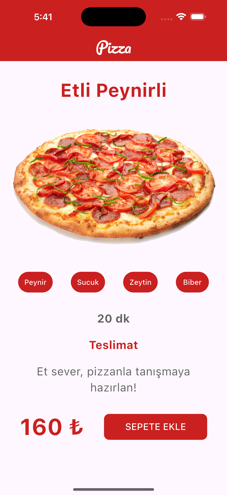

# Flutter Pizza UI

This project is my **first Flutter UI design** built during my learning journey.  
It showcases a simple pizza ordering screen with **multi-language support** (Turkish & English).  

## Features
- Simple UI design with Flutter
- Works on both iOS & Android
- Multi-language support (`app_tr.arb`, `app_en.arb`)
- Custom fonts and images
- Modern Material Design style

## Screenshots

| English | Turkish |
|---------|---------|
|  |  |

## Getting Started

Make sure you have Flutter installed on your machine.

### Clone the repository
``` bash
git clone https://github.com/yasemin-kir/flutter-first-app
```

### Navigate into the project directory
```bash
cd flutter-first-app
```

### Install dependencies
``` bash
flutter pub get
```

### Run the app
``` bash
flutter run
```

## Built With

- [Flutter](https://flutter.dev/)
- [Dart](https://dart.dev/)

## License

This project is licensed under the [MIT License](LICENSE) - feel free to use, modify, and share.
